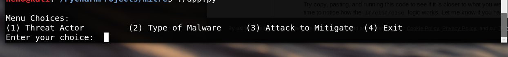

# Threat Actor and Malware Enumeration

This application will extract information from the pyattck database. 

## Usage:
                ./app.py
Upon invoking app, follow menu options. Once you select an option, a list of possible names will be shown. You will then be prompted to pick one of those names.

If you choose an invalid menu option, you will get an error message and be returned to the menu.

